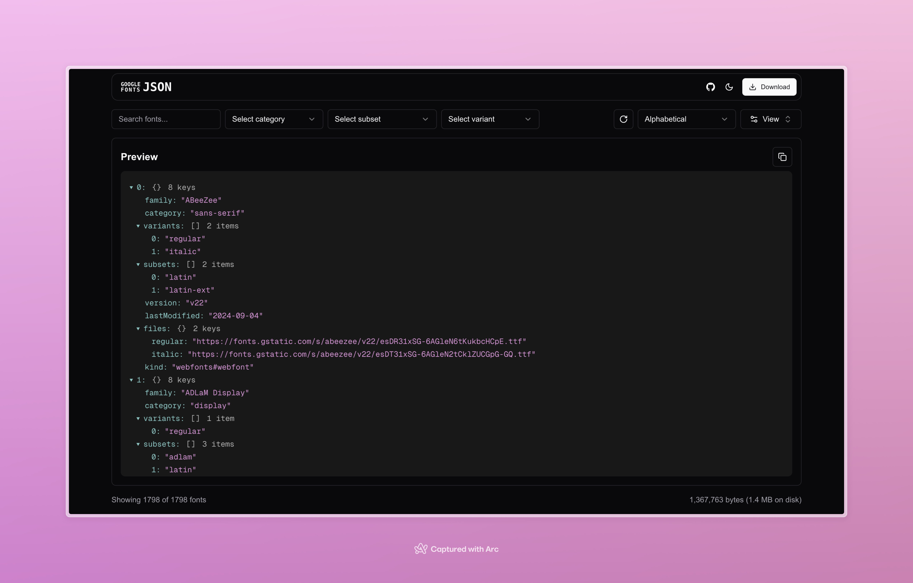

# Google Fonts JSON Viewer

A modern web application for viewing and exploring the Google Fonts JSON file in a clean, organized interface.



## Description

Google Fonts JSON Viewer is a specialized tool built with Next.js that provides an intuitive interface for browsing and analyzing the Google Fonts JSON data structure. It helps developers and designers explore font families, variants, and related metadata in a user-friendly format.

### Current Features

- 🔍 Interactive JSON preview with expandable/collapsible sections
- 🎨 Dark/Light theme support
- ⚡ Fast and responsive interface
- 🔤 Alphabetical sorting
- 📥 Download functionality
- 🎯 Category and subset filtering
- 🔄 Reset view options

### Planned Features

1. **Advanced Table View**

   - Customizable columns
   - Advanced filtering options
   - Sort by multiple parameters

2. **Batch Operations**

   - Select multiple font families
   - Bulk download selected items
   - Compare font properties

3. **Export Options**
   - CSV format export
   - YAML format export
   - Custom JSON structure export

## Getting Started

### Prerequisites

- Node.js 18.x or later
- npm or yarn package manager

### Installation

1. Clone the repository:

```bash
git clone https://github.com/jauharmuhammed/google-fonts-json.git
```

2. Install dependencies:

```bash
npm install
# or
yarn install
```

3. Run the development server:

```bash
npm run dev
# or
yarn dev
```

4. Open [http://localhost:3000](http://localhost:3000) in your browser

## Technologies Used

- [Next.js 14](https://nextjs.org/)
- [React](https://reactjs.org/)
- [Tailwind CSS](https://tailwindcss.com/)
- [Shadcn/UI](https://ui.shadcn.com/)
- [TypeScript](https://www.typescriptlang.org/)

## Contributing

Contributions are welcome! Please feel free to submit a Pull Request. For major changes, please open an issue first to discuss what you would like to change.

1. Fork the Project
2. Create your Feature Branch (`git checkout -b feature/AmazingFeature`)
3. Commit your Changes (`git commit -m 'Add some AmazingFeature'`)
4. Push to the Branch (`git push origin feature/AmazingFeature`)
5. Open a Pull Request

## Issues

Found a bug or have a feature request? Please file an issue:
[Create Issue](https://github.com/jauharmuhammed/google-fonts-json/issues)

## License

This project is licensed under the MIT License - see the [LICENSE](LICENSE.txt) file for details.

## Acknowledgments

- [Google Fonts](https://fonts.google.com/) for providing the font data
- [Next.js](https://nextjs.org/) team for the amazing framework
- All contributors who help improve this project

## Contact

Project Link: [https://github.com/jauharmuhammed/google-fonts-json](https://github.com/jauharmuhammed/google-fonts-json)

---

Made with ❤️ by [Your Name]
